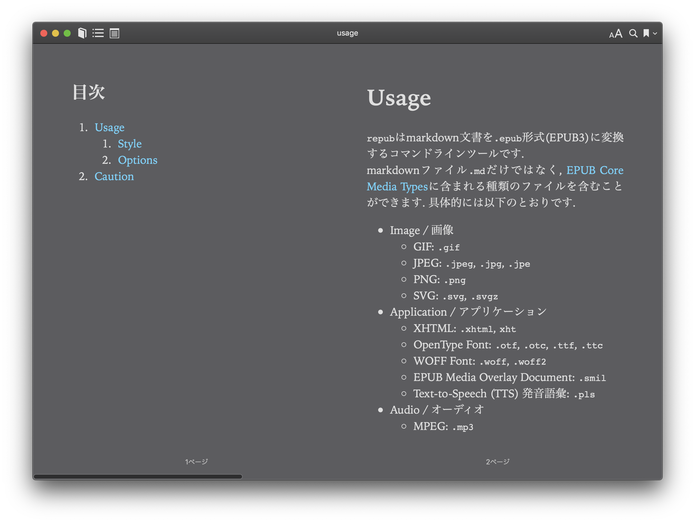

# Usage


`repub`はmarkdown文書を`.epub`形式(EPUB3)に変換するコマンドラインツールです. 
markdownファイル`.md`だけではなく, [EPUB Core Media Types](https://www.w3.org/publishing/epub3/epub-spec.html#sec-core-media-types)に含まれる種類のファイルを含むことができます. 具体的には以下のとおりです. 

- Image / 画像
    - GIF: `.gif`
    - JPEG: `.jpeg`, `.jpg`, `.jpe`
    - PNG: `.png`
    - SVG: `.svg`, `.svgz`
- Application / アプリケーション
    - XHTML: `.xhtml`, `xht`
    - OpenType Font: `.otf`, `.otc`, `.ttf`, `.ttc`
    - WOFF Font: `.woff`, `.woff2`
    - EPUB Media Overlay Document: `.smil`
    - Text-to-Speech (TTS) 発音語彙: `.pls`
- Audio / オーディオ
    - MPEG: `.mp3`
    - MP4: `.aac`, `.mp4`
- Text / テキスト
    - CSS: `.css`
    - javascript: `.js`

repubの使用法は以下のとおりです. 

```bash
repub <.md file XOR directory>
```

## Style
**変換対象のディレクトリ内にある`.css`ファイルは, 全てのコンテンツに適用されます.**

- markdown_directory
    - markdown0.md
    - markdown1.md
    - style.css

上記のような構成のディレクトリを変換した場合, `markdown0.md`および`markdown1.md`のどちらの変換にも, また生成された目次(`navigation.xhtml`)にも`style.css`が適用されます. 

## Options
### Help: --help
ヘルプを表示します. 

### Config: --config
設定ファイル(`repub_config.json`)を変換対象のディレクトリに保存します. 
変換対象のディレクトリに`repub_config.json`がある場合, 諸設定を`repub_config.json`から読み取ります. 
また, 実行コマンドのオプションを重ねることで, `repub_config.json`の命令の上書きが可能です. 

### Save: --save
一時ファイルを消去しません. 

### Verbose: --verbose
ログを表示します. 

### Book ID: -i, --bookid
`book id`を指定します. このオプションがない場合, book_idは自動で生成されます. 

### Creator: -c, --creator <creator>
作者, 編集者, 翻訳者などの名前を設定します. 

### Title: -t, --title <title>
タイトルを設定します. 

### ToC Depth: --toc-depth <toc_depth>
目次に表示するヘッダーのレベルを設定します. このオプションがない場合, 2に指定されます. 
3に指定した場合, `#`,`##`,`###`の3つのヘッダーが目次に表示されます. 

### Mode: --mode
縦書きのためのオプションです. [htb, vrl, vlr]から1つを指定します. このオプションがない場合, `htb`(横書き)に指定されます. 
詳しくは, [tategaki.md](../tategaki_vertical/tategaki.md)を参照してください. 

# Caution
windows, linux では`.epub`ファイルを生成することができないため, zip前の一時ファイルを出力します. 各種コンバーターをご利用ください. 